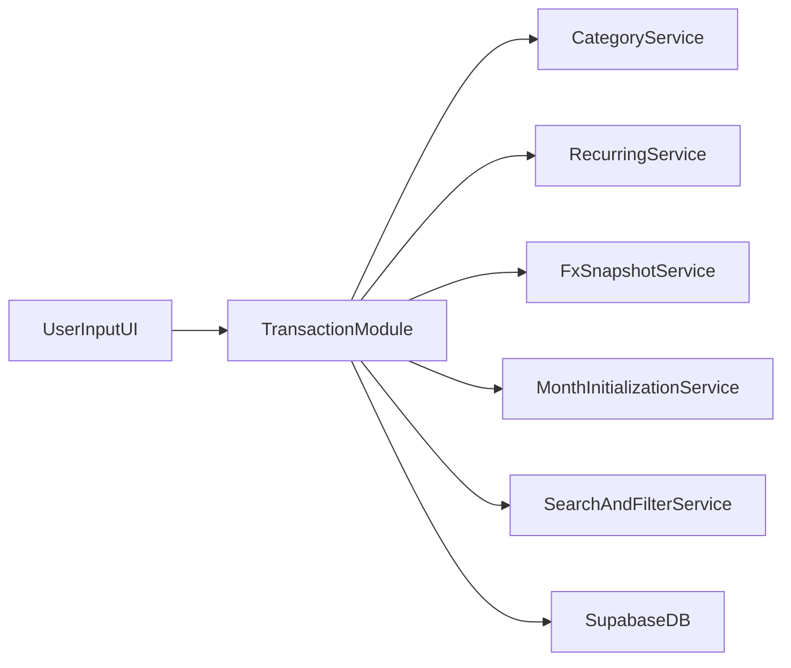

# Implementation plan

**Audience:** AI coding agents and engineers. Ground truth lives in the repo: `App.tsx`, `types.ts`, `constants.ts`, `components/*`, `supabase_schema.sql`, `services/exchangeRateService.ts`.

## Stack (current — do not replace core)

- **Frontend:** React, TypeScript, Vite (`package.json`, `index.tsx`, `App.tsx`).
- **Styling target:** Tailwind CSS via a **proper build pipeline** (PostCSS/Tailwind config in Vite), replacing reliance on CDN-only Tailwind in `index.html` where applicable.
- **Data:** Supabase client (`supabaseClient.ts`); schema in `supabase_schema.sql` (+ `migration_add_tax_savings.sql` for `is_tax_savings`).
- **Offline/demo:** `services/demoStorage.ts` + seed data. **Every feature must be fully testable in demo mode** — no exceptions. If a feature needs Supabase data, it needs a `demoStorage` counterpart shipped in the same task.

### Upgrade targets

| Layer | Current | Target | Rationale |
|-------|---------|--------|-----------|
| Framework | React 18.2 | React 19 | Latest stable |
| Routing | None (tab state) | React Router v7 | URL nav, deep linking |
| Styling | Tailwind CDN | Tailwind 3.x local build | Design tokens, purging |
| CSV parsing | None | PapaParse | Industry standard |
| AI | Gemini (receipts) | Gemini (receipts + statements + bulk) | Extend prompts |

Keep as-is: Vite 5.x, Supabase JS v2, Recharts, Lucide React, Vercel.

## High-level flow (today)

1. User authenticates (or uses demo).
2. App loads `transactions` for the session; year filter via `YearSelector` / `selectedYears` in `App.tsx`.
3. User adds/edits transactions via `TransactionForm`; list renders via `TransactionList`.
4. Global FX: `getExchangeRate` / `getExchangeRateOffline` feeds dashboard conversion; **`Transaction` rows do not yet store per-row FX** (`types.ts`).

## Target folder structure

```
src/
├── app/           # App.tsx (~30 lines), routes.tsx, AppShell.tsx
├── pages/         # Route-level: DashboardPage, MaaserPage, SettingsPage, etc.
├── components/    # Reusable UI primitives (Button, Modal, Card, Table)
├── features/      # Domain-specific (transactions/, maaser/, import/, recurring/)
├── services/      # Supabase abstraction (transactionService, categoryService, etc.)
├── hooks/         # Custom hooks (useTransactions, useCategories, useAuth)
├── contexts/      # AuthContext, ThemeContext
├── types/         # TypeScript definitions (index.ts)
└── lib/           # Utilities (constants, currency, dateUtils)
```

## Routing map (target)

```
/                → redirect to /dashboard
/login           → LoginPage (public)
/setup           → SetupPage (Supabase not configured)

[AppShell]       → Header, nav tabs, exchange rate
├── /dashboard   → DashboardPage (stats, charts, transactions)
├── /maaser      → MaaserPage (tracker + cross-currency credit)
├── /recurring   → RecurringPage (template management)
├── /investments → InvestmentsPage
├── /yearly      → YearlySummaryPage
├── /import      → ImportPage (CSV/Image/PDF wizard)
└── /settings    → SettingsPage (categories, family, dark mode)
```

Auth guard: all AppShell routes require authentication or demo mode.

## Feature areas (this roadmap)

### A. Tailwind modernization

- Add `tailwind.config.*`, `postcss.config.*`, and `@tailwind` entry in the main CSS bundle imported from `main`/`index` (follow Vite + Tailwind current docs).
- Remove or narrow CDN Tailwind in `index.html` once classes compile correctly.
- Prefer **design tokens** (CSS variables) for light/dark so components do not hardcode colors everywhere.

### B. Dark mode

- **One source of truth** for theme: e.g. `class` on `document.documentElement` (`dark`) + `prefers-color-scheme` optional default.
- Persist user choice in `localStorage`.
- Audit charts (`recharts`) and icons for contrast; use tokenized colors for series where needed.

### C. Transaction list: search, filter, default month

- **Default scope:** calendar **current month** (local timezone: document the chosen TZ rule in code comments when implementing—default to **browser local** unless product says otherwise).
- **Search:** minimum viable = case-insensitive match on `description` and `category`; extend only if needed.
- **Filters:** at least `type` (income/expense), `currency`, optional category multi-select once dynamic categories exist.
- Integrate with existing **year** multi-select only if product requires; if conflict, **month filter wins for default list** and year can narrow the month picker’s available range—decide in UI copy, don’t silently combine in confusing ways.

### D. Dynamic categories

- Today: `EXPENSE_CATEGORIES` / `INCOME_CATEGORIES` in `constants.ts`, consumed by `TransactionForm`.
- Target: **per-family** category rows in Supabase, e.g. `categories` table: `id`, `family_id`, `name`, `kind` (`INCOME`|`EXPENSE`), `sort_order`, `created_at`, optional `archived_at`.
- RLS: mirror `transactions` family scoping (select/insert/update for same family only).
- Migration: seed initial categories from current constants for existing families **or** lazy-migrate on first load (pick one strategy in tasks; prefer explicit migration for determinism).
- UI: manage categories (rename, archive — **one behavior per task** in `tasks.md`).

### E. Recurring controls (off + max X payments)

- Today: `isRecurring` boolean on `Transaction` / `is_recurring` column—no schedule or cap.
- Target (minimal schema): extend transaction or add `recurring_meta`—example fields:
  - `recurring_active` boolean (or reuse `is_recurring` with explicit semantics),
  - `recurring_remaining_count` nullable int (null = unlimited),
  - `recurring_cancelled_at` nullable timestamp (optional audit).
- Product rule for “max payments”: define whether count means **months** or **duplicate rows** generated (today app does not auto-generate future rows; likely **semantic cap** for reporting + manual discipline, or **future** generator—**start with manual rows + visible remaining count** unless product mandates generation).
- `RecurringPanel` should respect cancelled/capped state.

### F. Copy transaction → form

- From list row action: clone fields into `TransactionForm` **as new** (new `id`, clear or adjust `date` per rule—default **keep date** or **today**: choose “today” for faster re-entry unless user is duplicating historical audit).
- Do not mutate original until user saves.

### G. Exchange rate snapshot on create

- Add columns on `transactions`, e.g. `fx_usd_to_ils_snapshot numeric`, `fx_ils_to_usd_snapshot numeric`, `fx_rate_date text` (aligns with existing `exchange_rates.date` text style), or a single pair as stored at save time.
- On insert/update (if amounts/currency change): populate from the same source `getExchangeRate` uses **at save time**; if offline, follow `getExchangeRateOffline` fallback and still persist what was used.
- Dashboard conversions may still use “live” rate for **estimates**, but per-row displays can show **snapshotted** rate for audit—document in UI when they differ.

### H. Month initialization rule

- **Rule:** “Month is initiated on **first** insert of income **or** expense.”
- Implementation needs a **durable** flag per family + month, e.g. `family_month_state` table: `family_id`, `month` (`YYYY-MM`), `opened_at`, `opened_by_transaction_id` nullable—**first write wins**.
- UX: subtle header/badge “Working month: YYYY-MM (opened on …)” once set; do not block inserts from other months if user selects another range—**clarify in UI** whether rule is informational only or blocks cross-month entry. **Default recommendation:** informational + default filter to current month, not hard block.

## Data model sketch (illustrative)

Exact names belong in migrations; this is the intended shape:

```text
categories (family-scoped)
transactions (+ fx snapshot columns, + recurring cap fields)
family_month_state (optional but recommended for H)
```

### Migration principle

All migrations are **additive** — no column drops, no breaking changes, supporting rolling deployment.

### Standard RLS pattern (family-scoped)

Use this pattern for any new family-scoped table:

```sql
alter table <table_name> enable row level security;

create policy "View own family" on <table_name> for select
  using (family_id in (select family_id from profiles where id = auth.uid()));
create policy "Insert own family" on <table_name> for insert
  with check (family_id in (select family_id from profiles where id = auth.uid()));
create policy "Update own family" on <table_name> for update
  using (family_id in (select family_id from profiles where id = auth.uid()));
create policy "Delete own family" on <table_name> for delete
  using (family_id in (select family_id from profiles where id = auth.uid()));
```

## Mermaid (target modules)



## Risks and mitigations

| Risk | Mitigation |
|------|------------|
| RLS regression on new tables | Ship policies in same migration; test with two users in different families |
| Date-as-text bugs | Centralize `YYYY-MM-DD` parsing; add tests for month boundaries |
| FX inconsistency | Always snapshot on save; show “as of” date in UI |
| Tailwind migration breaks layout | Migrate incrementally; keep a short checklist page in PR description |

## Verification

- Manual: **demo mode first**, then Supabase mode for each new behavior. If it doesn't work in demo, it's not done.
- Automated: add unit tests for pure helpers (month calc, filter pipeline, category merge) when extracted from `App.tsx`.

## Deferred (see `tasks.md` Phase X)

- Bulk statement import / screenshot parsing pipeline.
- Ma’aser “cancel remaining balance” product flow.
